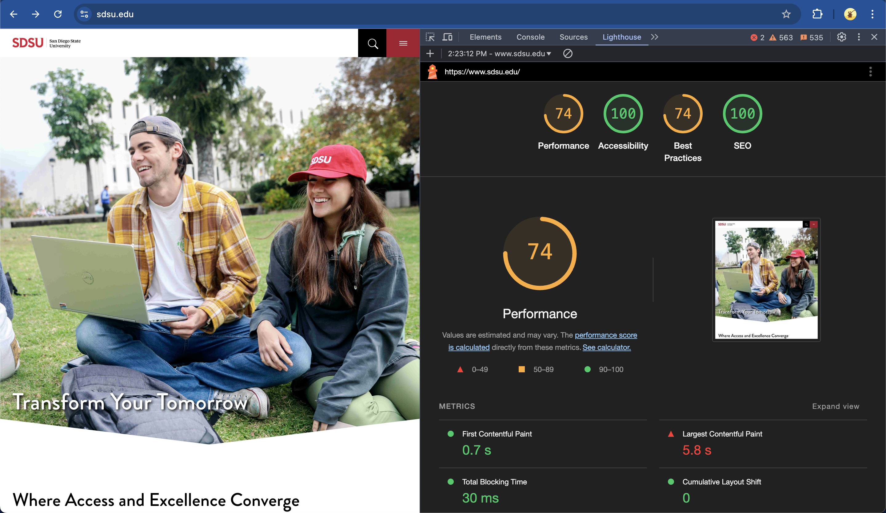

# CSE134B-SS20-HW1
# Name: David De Santiago
# PID: A17001592

## Part 1. Homework Tasks and Answers

### Question 1. Introduction to Web Technologies

Deployed Netlify Site URL: [https://aquamarine-kleicha-f98b3b.netlify.app](https://aquamarine-kleicha-f98b3b.netlify.app)

Screenshot of the homepage with my name and major included:

### Question 2. Chrome DevTools - Network

#### Number of Requests by Content Type:
- **HTML:** 1
- **CSS:** 1
- **JavaScript:** 1
- **Font:** 1
- **Images:** 4 (PNG, GIF, JPEG)
- **Media:** 1
- **SVG:** 5
- **Favicon:** 1

#### Total Number of Requests:
16

#### Total Bytes Sent:
6.7 MB transferred, 6.9 MB resources

#### Waterfall Graph:

### Question 3. Client-Side Inherently Insecure Demo

Screenshot of the changes made:

## Part 2. Screen Reader Navigation Experience

### Navigating ESPN.com:
- **Easy Parts:**
  - I was able to find the "Top Headlines" section relatively quickly because I am already familiar with the ESPN website layout. As someone passionate about sports, I frequently visit ESPN, so I had an idea of where to look for the headlines, even without visually navigating.
- **Difficult Parts:**
  - Navigating solely with the screen reader was challenging because I am not used to this method of interaction. Moving between headings and links using the commands felt unintuitive at times, especially when trying to locate specific sections.

### Navigating WebAIM.org:
- **Easy Parts:**
  - None. Navigating WebAIM.org using the screen reader was unfamiliar and confusing.
- **Difficult Parts:**
  - I was unable to locate the "Web Accessibility Virtual Training" page or the FAQ section to determine if the training is archived. The process felt difficult because I had no prior familiarity with the website and the structure wasn’t as clear or easy to follow using the screen reader.

### General Reflection:
- **Experience:**
  - Completing this task was both easy and hard at the same time. While the commands for skipping between headings and links were useful, I found the overall process challenging because I’m not accustomed to using a screen reader. This was a completely new experience for me, and it required a lot of focus and patience to understand how the navigation worked.

## Part 3. HTTP Response Headers + Network Analysis

### Question 1. HTTP Response Headers + Network Analysis

#### HTTP Response Headers
- **UCI Response Headers Screenshot (Part 1):**
  
- **UCI Response Headers Screenshot (Part 2):**
  

- **UCSD Response Headers Screenshot (Part 1):**
  
- **UCSD Response Headers Screenshot (Part 2):**
  

#### Analysis of HTTP Response Headers
- **UCI**:
  - **Positive Observations**:
    - `Strict-Transport-Security` enforces HTTPS.
    - `X-Frame-Options` and `X-XSS-Protection` are present, mitigating clickjacking and XSS attacks.
  - **Potential Issues**:
    - Missing `Content-Security-Policy` for enhanced security against XSS and other attacks.
  - **Data Breakdown**:
    - **Documents (HTML):** 1.04%
    - **Stylesheets (CSS):** 3.6%
    - **Scripts (JavaScript):** 14%
    - **Fonts:** 0.85%
    - **Images:** 78.1%

- **UCSD**:
  - **Positive Observations**:
    - `Cache-Control` ensures sensitive content isn’t cached locally.
    - `Content-Type` is properly set to `text/html; charset=UTF-8`.
  - **Potential Issues**:
    - Missing key security headers: `Strict-Transport-Security`, `X-Frame-Options`, and `X-XSS-Protection`.
  - **Data Breakdown**:
    - **Documents (HTML):** 0.93%
    - **Stylesheets (CSS):** 4.84%
    - **Scripts (JavaScript):** 14.5%
    - **Fonts:** 0.72%
    - **Images:** 79.03%

### Question 2. JavaScript Off

#### **UCSD:**
- **Visual Changes:**
  - The layout of the homepage remained mostly intact.
  - Some interactive elements like animations and pop-ups were missing.
  - Static content and navigation links were visible, but functionality was limited.
  - **Screenshot:**  
    

- **Broken Features:**
  - Search bar functionality did not work.
  - Some dynamic elements such as drop-down menus and hover effects were disabled.
  - Interactive elements like forms did not function properly.

#### **Scripps:**
- **Visual Changes:**
  - The homepage was completely blank with no visible content.
  - This indicates that the site relies heavily on JavaScript to load and display content.
  - **Screenshot:**  
    

- **Broken Features:**
  - All content failed to load due to heavy reliance on JavaScript.
  - The site was essentially non-functional.

#### **UCLA:**
- **Visual Changes:**
  - The layout was partially intact, with static content visible.
  - Dynamic elements like sliders or interactive news tiles were not operational.
  - **Screenshot:**  
    

- **Broken Features:**
  - Search functionality and interactive menus were non-functional.
  - Some images and videos failed to load, affecting the visual presentation.
  - Dynamic navigation and pop-ups were entirely disabled.
  
### Question 3. Custom vs. Default 404 Pages

#### CSUCI
- **Does csuci.edu have a custom 404 page?**  
  Yes, csuci.edu has a custom 404 page.

- **URL used to check:**  
  [https://www.csuci.edu/doyouexistpage????](https://www.csuci.edu/doyouexistpage????)

- **Details:**  
  The custom 404 page includes the university branding, a friendly message informing the user that the page doesn’t exist, and links to navigate back to the homepage or other relevant areas of the website.

#### JPCatholic
- **Does jpcatholic.edu have a custom 404 page?**  
  No, jpcatholic.edu does not have a custom 404 page.

- **URL used to check:**  
  [https://www.jpcatholic.edu/doyouexistpagetoo????](https://www.jpcatholic.edu/doyouexistpagetoo????)

- **Details:**  
  The default 404 page is plain, with no branding or helpful navigation links. It simply shows a generic "404 Not Found" message.

- **Better User Experience:**  
  Custom 404 pages can provide users with helpful navigation links to get back on track, such as links to the homepage, site map, or popular sections of the website.

- **Brand Consistency:**  
  A custom 404 page allows organizations to maintain their branding and tone of voice even when an error occurs, keeping the experience professional and cohesive.

- **Reduces Frustration:**  
  Default 404 pages can be confusing and leave users feeling stuck, increasing the likelihood that they will leave the site. A custom 404 page reassures users and helps them find their way.

- **SEO Benefits:**  
  Custom 404 pages can reduce bounce rates and improve user engagement by directing visitors to other useful areas of the site.

### Question 4. Search Engines - robots.txt

#### Does nytimes.com have a `robots.txt` file?  
Yes, `nytimes.com` has a `robots.txt` file.  

- **Screenshot:**  
  

#### Concerns About the `robots.txt` File:  
The main issue with the `robots.txt` file is that it can reveal too much. Listing what bots shouldn’t crawl is basically like putting up a sign that says, “Hey, look over here, this is sensitive!” For someone with malicious intent, it might give them an idea of where to dig deeper. It’s not actually a security feature—it’s more like a polite request to bots, and not all bots play nice.

#### Bot-Specific Rules and Concerns:  
NYT has rules for specific bots, and it looks like they’re especially worried about bots used for AI and machine learning. For example, they explicitly disallow data scraping for “large language models (LLMs)” and AI-related purposes. This is probably because their content is premium and they don’t want it being used to train models or for other commercial purposes without permission. These new rules show that they’re aware of how their content could be exploited, especially with the rise of AI tools that rely on massive amounts of data. It’s interesting to see how companies are adapting to these kinds of challenges—it’s a reflection of how much AI is shaping the digital landscape.

### Question 5. Search Engines - Google Hacking

#### What Does “Google Hacking” Mean?  
“Google Hacking” refers to using advanced Google search operators to find sensitive or hidden information that web developers may have accidentally exposed. This includes things like login credentials, admin panels, unsecured databases, or even personal data that shouldn't be publicly accessible. It's not hacking in the traditional sense of breaking into a system—it’s about exploiting what’s already indexed and publicly available in Google’s search results.

#### What Is the Google Bot Doing That’s Troubling?  
The Google Bot is extremely thorough in crawling and indexing websites. It indexes not only the intended public content but also files and pages that might not have been meant to be visible. If a website’s `robots.txt` file or security configurations aren’t set up properly, sensitive files like configuration backups, old logs, or even database dumps can accidentally end up indexed and searchable. This makes it easier for attackers to exploit vulnerabilities without ever having to directly attack the website—they’re just using Google as their tool.

#### What Should Web Developers Be Worried About?  
As developers, we need to be cautious about what we leave exposed on the web. This includes:
1. **Sensitive Files:** Never store backups, logs, or sensitive configuration files in public directories.
2. **Improper Permissions:** Ensure proper permissions on files and directories so only intended users can access them.
3. **Use of `robots.txt`:** While helpful, `robots.txt` isn’t a security feature. Just because you block a page or file with `robots.txt` doesn’t mean it’s completely hidden. Developers should use proper authentication and access controls for sensitive areas instead.
4. **Default Pages:** Be sure to remove or secure default installation pages or files (e.g., `/admin`, `/phpinfo.php`), as these can expose vulnerabilities.

#### How Is This Question Related to Question 4?  
This question ties back to Question 4 because both highlight the importance of controlling what search engine bots can access and index. The `robots.txt` file is meant to help manage what gets indexed, but if it’s not set up correctly, it can inadvertently expose sensitive paths. Similarly, “Google Hacking” shows how improperly managed content can become accessible to the public and potentially be misused. Both questions emphasize the need for web developers to take security precautions to ensure only the intended content is publicly available.

### Question 6. Search Engines - Results Reality Check

#### Query: "Why UCSD is awesome" (without quotation marks)

**100-110th Results on Google:**
- **100:** [https://greatergood.berkeley.edu/](https://greatergood.berkeley.edu/)
- **101:** [https://x.com/aedmondstv/status/1869242038837039246](https://x.com/aedmondstv/status/1869242038837039246)
- **102:** [https://resnet.ucsd.edu/about/index.html](https://resnet.ucsd.edu/about/index.html)
- **103:** [https://www.dcurbanmom.com/dev/posts/list/15/1202407.page](https://www.dcurbanmom.com/dev/posts/list/15/1202407.page)
- **104:** [https://www.sutd.edu.sg/](https://www.sutd.edu.sg/)
- **105:** [https://www.collegemagazine.com/colleges/university-of-san-diego/](https://www.collegemagazine.com/colleges/university-of-san-diego/)
- **106:** [https://www.california.com/uc-or-csu-heres-how-pick-whats-right-you/](https://www.california.com/uc-or-csu-heres-how-pick-whats-right-you/)
- **107:** [https://lajollamom.com/best-hotels-near-ucsd-la-jolla/](https://lajollamom.com/best-hotels-near-ucsd-la-jolla/)
- **108:** [https://admission.ucla.edu/](https://admission.ucla.edu/)
- **109:** [https://collegenet.com/](https://collegenet.com/)
- **110:** [https://news.ycombinator.com/item?id=579690](https://news.ycombinator.com/item?id=579690)

---

#### Comparison of First Page Results (Google vs. DuckDuckGo)

**DuckDuckGo:**
1. [https://admissions.ucsd.edu/why/index.html](https://admissions.ucsd.edu/why/index.html)
2. [https://blog.collegevine.com/what-is-ucsd-known-for/](https://blog.collegevine.com/what-is-ucsd-known-for/)
3. [https://www.rebellionresearch.com/why-is-ucsd-awesome](https://www.rebellionresearch.com/why-is-ucsd-awesome)
4. [https://www.reddit.com/r/UCSD/comments/tjiivf/can_you_kindly_share_your_honest_opinions_on_ucsd/](https://www.reddit.com/r/UCSD/comments/tjiivf/can_you_kindly_share_your_honest_opinions_on_ucsd/)
5. [https://www.ucsd.edu/about/index.html](https://www.ucsd.edu/about/index.html)
6. [https://academicful.com/ucsd-good-school/](https://academicful.com/ucsd-good-school/)
7. [https://today.ucsd.edu/story/uc-san-diego-ranked-nations-no-6-best-public-university-by-u.s-news-and-world-report](https://today.ucsd.edu/story/uc-san-diego-ranked-nations-no-6-best-public-university-by-u.s-news-and-world-report)
8. [https://collegegazette.com/what-is-ucsd-known-for-is-ucsd-a-good-school/](https://collegegazette.com/what-is-ucsd-known-for-is-ucsd-a-good-school/)
9. [https://grad.ucsd.edu/admissions/prospective-student/why-choose-uc-san-diego.html](https://grad.ucsd.edu/admissions/prospective-student/why-choose-uc-san-diego.html)
10. [https://www.reddit.com/r/UCSD/comments/mzg1o9/why_uc_san_diego/](https://www.reddit.com/r/UCSD/comments/mzg1o9/why_uc_san_diego/)

**Google:**
1. [https://www.reddit.com/r/UCSD/comments/ijo32d/why_is_ucsd_so_slept_on/](https://www.reddit.com/r/UCSD/comments/ijo32d/why_is_ucsd_so_slept_on/)
2. [https://admissions.ucsd.edu/why/index.html](https://admissions.ucsd.edu/why/index.html)
3. [https://grad.ucsd.edu/admissions/prospective-student/why-choose-uc-san-diego.html](https://grad.ucsd.edu/admissions/prospective-student/why-choose-uc-san-diego.html)
4. [https://www.quora.com/Why-did-you-go-to-UCSD](https://www.quora.com/Why-did-you-go-to-UCSD)
5. [https://www.unigo.com/colleges/university-of-california-san-diego/what-is-your-overall-opinion-of-this-school](https://www.unigo.com/colleges/university-of-california-san-diego/what-is-your-overall-opinion-of-this-school)
6. [https://blog.collegevine.com/what-is-ucsd-known-for](https://blog.collegevine.com/what-is-ucsd-known-for)
7. [https://www.usnews.com/best-colleges/university-of-california-san-diego-1317](https://www.usnews.com/best-colleges/university-of-california-san-diego-1317)
8. [https://www.youtube.com/watch?v=4i9bAg5nbFo&pp=ygUGI2R1Y3Nk](https://www.youtube.com/watch?v=4i9bAg5nbFo&pp=ygUGI2R1Y3Nk)
9. [https://www.quora.com/Why-is-UC-San-Diego-so-prestigious](https://www.quora.com/Why-is-UC-San-Diego-so-prestigious)
10. [https://talk.collegeconfidential.com/t/is-ucsd-a-good-school/1871754](https://talk.collegeconfidential.com/t/is-ucsd-a-good-school/1871754)

---

#### Similarities and Differences:
- **Similarities:** Both Google and DuckDuckGo highlight official pages like the UCSD admissions site and rankings, as well as student-focused platforms like CollegeVine, Niche, and Reddit.
- **Differences:** Google includes more authoritative sources such as US News and Times Higher Education, while DuckDuckGo leans more toward community discussions on Reddit and opinion-based articles like College Gazette.

---

#### Preference and Why:
I prefer **Google** because it delivers a mix of authoritative sources and student testimonials, which feels more balanced for a query like this. DuckDuckGo is great for exploring community opinions, but Google provides more reliable and comprehensive resources when looking for detailed or official information about UCSD.

### Question 7. Chrome DevTools - JavaScript Console and Local Storage

#### JavaScript Console:
- **Screenshot:**
  

- **Why Did Medium Put This Information There?**
  Medium’s console message is a recruitment strategy. They’re trying to grab the attention of developers who might inspect their console out of curiosity. By adding a friendly hiring message, they’re encouraging developers to consider joining their team. It’s also a way to create a memorable interaction.

#### Local Storage:
- **Screenshot:**
  

- **What Are These Values Set and Used For?**
  The values in the local storage seem to track user preferences, session details, and interactions with the site. For example:
  - `viewer-statusjs-logged-in`: Tracks whether the user is logged in.
  - Other keys store session-specific data or user behavior, like articles viewed or engagement metrics. These values are used to provide a personalized experience, such as resuming reading progress, remembering login states, or tailoring content recommendations. They also help Medium analyze user behavior for better site optimization and targeted marketing.
  
### Question 8. Chrome DevTools - User-Agent Header

#### Does Google do something different?  
Yes, Google changes the layout of the page when the user agent header is altered to mimic an iPhone. The page adjusts to a mobile-optimized interface with larger elements, simplified design, and features suited for smaller screens.

#### Evidence of User-Agent Header Change:  
The User-Agent header in the request is shown as: Mozilla/5.0 (iPhone; CPU iPhone OS 13_2 like Mac OS X) AppleWebKit/605.1.15 (KHTML, like Gecko) CriOS/131.0.0.0 Mobile/15E148 Safari/604.1

This confirms that the browser successfully sent the modified user agent for an iPhone.

#### Screenshot of Mobile Layout and Network Request:  

#### Observed Differences:  
- The Google homepage switched to a **mobile layout** with a larger search bar and simplified design, optimized for smaller screens.
- Certain features, such as the footer links and additional navigation options, were condensed or removed to fit the mobile view.

### Question 9. Chrome DevTools - Extension Header

#### Extension Headers Observed on bootstrapcdn.com:
1. **X-Powered-By**
   - **Value:** Express
   - **Purpose:** This header indicates the backend framework used to serve the site. In this case, it’s powered by the Express.js framework, commonly used for Node.js applications. It provides no functional benefit to the client but can give insights to developers or attackers about the underlying technology.

2. **X-Content-Type-Options**
   - **Value:** nosniff
   - **Purpose:** This header prevents the browser from guessing or "sniffing" the MIME type. It forces the browser to strictly follow the declared `Content-Type`. This helps protect against certain types of attacks, like MIME type confusion or execution of unintended scripts.

3. **X-Frame-Options**
   - **Value:** SAMEORIGIN
   - **Purpose:** This header controls whether the website can be embedded in an `<iframe>`. The value `SAMEORIGIN` ensures that the content can only be framed by pages from the same origin. This helps prevent clickjacking attacks.

4. **X-XSS-Protection**
   - **Value:** 1; mode=block
   - **Purpose:** This header enables the browser’s built-in XSS protection mechanism. If a potential cross-site scripting (XSS) attack is detected, the browser will block the page from loading rather than executing potentially malicious scripts.

5. **X-Cache**
   - **Value:** HIT or MISS (may vary)
   - **Purpose:** This header indicates whether the content was served from the cache (`HIT`) or fetched from the server (`MISS`). It’s used for performance optimization by reducing server load and improving page load times.

6. **X-Akamai-Transformed**
   - **Value:** (varies)
   - **Purpose:** This header is specific to Akamai’s content delivery network (CDN). It indicates whether and how the content has been transformed (e.g., compressed or optimized) by Akamai before being delivered to the client.

#### Screenshot:

#### Importance of Understanding Extension Headers:
These headers are useful for debugging, security, and optimization purposes. They provide insight into how the website operates, what security measures are in place, and how the content is being delivered. However, exposing too much information, such as the framework in use (`X-Powered-By`), can make the site more vulnerable to targeted attacks.

### Question 10. Chrome DevTools - Performance Test

#### Lighthouse Audit on UCSD.edu
**Screenshot:**

**Scores:**
- **Performance:** 58
- **Accessibility:** 66
- **Best Practices:** 74
- **SEO:** 92

**Top Two Suggestions for Improvement:**
1. **First Contentful Paint (FCP):**
   - **Explanation:** FCP measures how long it takes for the first visible content to appear. Improving FCP involves optimizing server response times, removing or deferring render-blocking resources (like JavaScript and CSS), and implementing efficient caching strategies.
   - **Improvement:** Compress and lazy load images, minimize CSS/JavaScript files, and serve static resources with a Content Delivery Network (CDN).

2. **Largest Contentful Paint (LCP):**
   - **Explanation:** LCP measures the time taken to render the largest visible content (usually images or text). To improve LCP, prioritize rendering above-the-fold content and optimize large media files.
   - **Improvement:** Optimize image sizes, enable lazy loading, and minimize layout shifts by specifying image dimensions.

---

#### Lighthouse Audit on SDSU.edu
**Screenshot:**

**Scores:**
- **Performance:** 74
- **Accessibility:** 100
- **Best Practices:** 74
- **SEO:** 100

**Top Two Suggestions for Improvement:**
1. **Largest Contentful Paint (LCP):**
   - SDSU has a slower LCP (5.8 seconds). Similar to UCSD, they should optimize media files and minimize delays in rendering large, visible elements.

2. **Total Blocking Time:**
   - Reduce long JavaScript execution times and optimize third-party scripts to decrease blocking.

---

#### Comparison Between UCSD and SDSU

| Metric              | UCSD | SDSU |
|---------------------|------|------|
| **Performance**     | 58   | 74   |
| **Accessibility**   | 66   | 100  |
| **Best Practices**  | 74   | 74   |
| **SEO**             | 92   | 100  |

**Which School Needs More Work?**
- UCSD needs more improvement. With lower scores in Performance (58 vs. 74) and Accessibility (66 vs. 100), UCSD's website would benefit from optimizations for faster loading and improved usability. SDSU already has strong scores in Accessibility and SEO, though they can still enhance their Largest Contentful Paint and overall Performance metrics.

### Question 11. Browsers Versions

#### 1. URLs for Platform Status Pages:
- **Chrome Platform Status:** [https://chromestatus.com/roadmap](https://chromestatus.com/roadmap)
- **Firefox Platform Status:** [https://platform-status.mozilla.org](https://platform-status.mozilla.org) *(Note: The page currently shows a "Your connection is not private" error, as captured in the screenshot below.)*
  
- **Edge Platform Status:** [https://admin.microsoft.com/servicestatus](https://admin.microsoft.com/servicestatus)
- **Safari Feature Status:** [https://webkit.org/status/](https://webkit.org/status/)

#### 2. What Version of Chrome Introduced Shadow DOM v1?
- Shadow DOM v1 was introduced in **Chrome 53**.
- Source: [Chrome Platform Status - Shadow DOM v1](https://chromestatus.com/feature/4574486762825728)

#### 3. Release Date of Shadow DOM v1 in Chrome:
- Chrome 53 was released on **August 31, 2016**.
- Source: [Chrome Release History](https://chromiumdash.appspot.com/releases?platform=Linux)

#### 4. How Old Is Chrome?
- Chrome was first released on **September 2, 2008**.
- As of today (January 19, 2025), Chrome is **16 years and 4 months old**.

### Question 12. Testing Different or Older Browsers

#### Using BrowserStack to Test Firefox v25 on UCSF.edu

- **Screenshot of Result:**  
  

#### Observations:
When testing UCSF.edu on Firefox version 25, the page failed to load due to a "Secure Connection Failed" error. This error indicates that the website's current security protocols are incompatible with the older browser. Specifically, UCSF.edu likely requires modern SSL/TLS protocols (like TLS 1.2 or TLS 1.3), which are not supported by outdated browser versions like Firefox v25.

#### Discussion on Browser Support:
1. **Progressive Enhancement:**
   - Websites should aim to provide core functionality and content on as many browsers as possible, even older ones. This ensures a broader audience can access important information, regardless of their browser.

2. **Graceful Degradation:**
   - When a website cannot fully function on older browsers, it should still display basic content or provide a helpful message directing users to upgrade their browser.

3. **Modern Standards:**
   - Maintaining compatibility with very old browsers is often resource-intensive and unnecessary for most organizations. Modern web development focuses on supporting the last two major browser versions, ensuring security and performance without spreading resources too thin.

4. **Security Considerations:**
   - Websites prioritize modern encryption and secure connections to protect user data. Older browsers that cannot meet these standards are often excluded from support, as the risks of enabling outdated protocols outweigh the benefits.

#### Conclusion:
Testing on an outdated browser like Firefox v25 highlights the importance of updating browsers to ensure compatibility and security. Developers should consider user demographics but balance this with the need to adhere to modern web standards and security practices.

### Question 13. UCSF.edu

#### X-Content-Type-Options Header
The UCSF website uses the `X-Content-Type-Options` header with the value **`nosniff`**. This header is essential for improving security by preventing the browser from "sniffing" the MIME type of a file. Instead of trying to guess the file type, the browser strictly adheres to the `Content-Type` declared by the server. For example, if a file is labeled as `text/plain`, the browser won’t attempt to interpret it as `application/javascript`. This helps prevent attacks like **MIME-type confusion**, where improperly declared files could be executed in a way that compromises the site or its users.

- **Header Value: `nosniff`**
- **Purpose:**
  - Prevents the browser from executing files with incorrect MIME types.
  - Protects against MIME-type confusion attacks.
  - Ensures stricter adherence to the server-declared Content-Type.

#### Cloudflare Usage
The UCSF website also employs **Cloudflare**, as indicated by headers like `cf-cache-status` and `cf-ray`. Cloudflare is a **Content Delivery Network (CDN)** and security service that enhances the performance, reliability, and security of websites.

- **What Cloudflare Does:**
  - **Improves Performance:**
    - Caches content at servers closer to users to reduce loading times.
    - Optimizes website resources for faster delivery.
  - **Provides Security:**
    - Protects against Distributed Denial-of-Service (DDoS) attacks.
    - Hides the origin server’s IP address to prevent direct attacks.
    - Filters harmful traffic and mitigates potential threats.
  - **Caching:**
    - Speeds up content delivery by serving cached responses for frequently accessed pages.
    - Reduces the load on the origin server.

#### Screenshots
- **Response Headers:**
  

#### Observations
The use of the `X-Content-Type-Options` header demonstrates UCSF's effort to enforce secure practices, while leveraging Cloudflare ensures better performance and robust protection against various online threats.

### **Question 14. Cookies**

#### **UCSD Homepage**
- **Number of Cookies:** 42  
- **Number of Unique Domains:**
  1. `https://www.ucsd.edu`
  2. `https://www.google.com`
  3. `https://www.youtube.com`
  4. `https://accounts.google.com`
  5. `https://doubleclick.net`

---

#### **SDSU Homepage**
- **Number of Cookies:** 36  
- **Number of Unique Domains:**
  1. `https://www.sdsu.edu`
  2. `https://dt.doubleclick.net`
  3. `https://8a57e258-cf07`
  4. `https://www.google.com`
  5. `https://www.youtube.com`

---

### **Comparison**
- UCSD has slightly more cookies (42) compared to SDSU (36).  
- Both pages use cookies from **Google**, **YouTube**, and **DoubleClick**, indicating shared reliance on advertising and analytics tools.